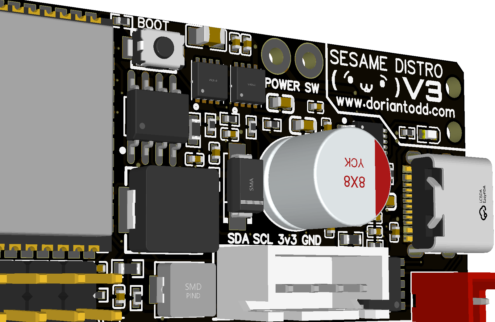
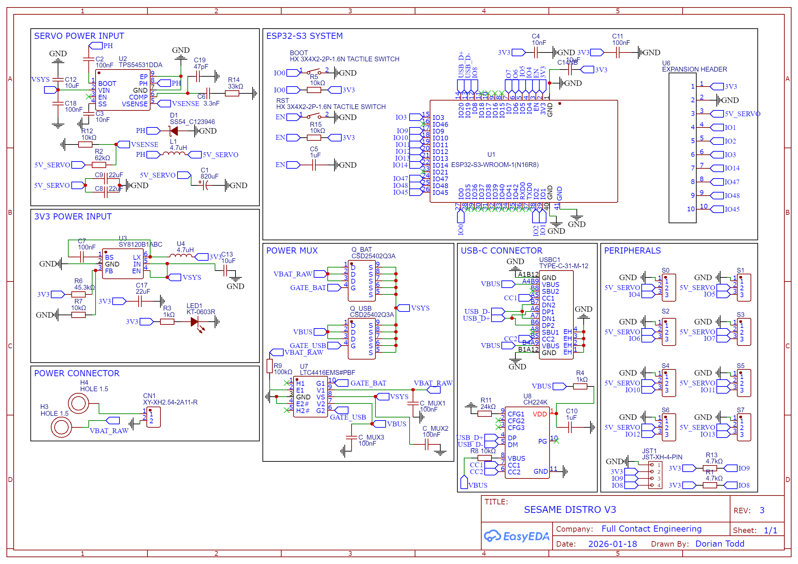
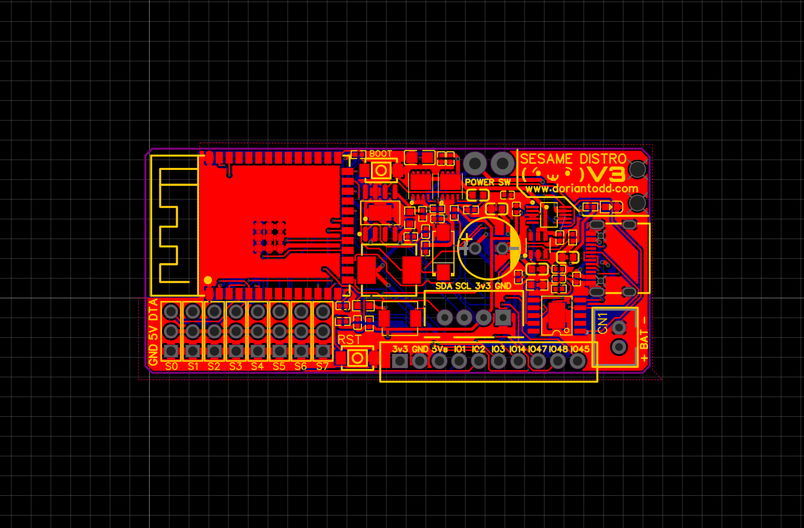
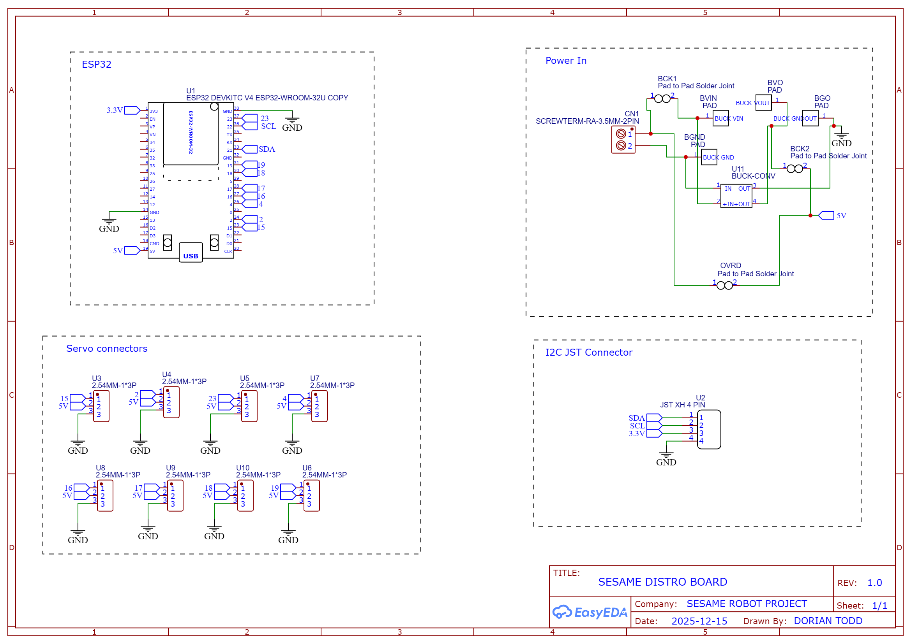

# PCB Schematics

Electronic schematics and PCB designs for the Sesame Robot Project. There are two versions of the Sesame Distro Board available: V3 (current), V2 (legacy), and V1 (legacy).

> [!NOTE]
> **For Sesame Build Kits:** All Sesame Build Kits include a pre-flashed Sesame Distro Board V3 (or earlier V2), so you don't need to order or assemble a board separately.

> [!TIP]
> **Building from Scratch?** If you're building a Sesame Robot from scratch, we recommend using the **S2 Mini with hand wiring approach** for the easiest assembly experience. The V2/V3 distro boards use advanced SMD components that require specialized soldering skills or PCB assembly services.

---

## Sesame Distro Board V3 (Current)

The **Sesame Distro Board V3** is the latest version and features:

- **ESP32-S3 Processor**
- **USB-C PD 12V** (requires high quality PD charger cable)
- **Bambu Lab 14500 Battery Connector** for cheap and effective battery powering (priority feature)
- One-click order link via PCBway: [Order On PCBway!](https://www.pcbway.com/project/shareproject/Sesame_Distro_Board_V3_377de6fe.html)
- Limited stock of pre-assembled units: [Full Contact Engineering](https://fullcontactengineering.com/products/sesame-distro-board-v3-pcb)
  *Note: Due to time constraints, the USB-C PD 12V negotiation chip is slightly untested, so a high quality PD cable is necessary.*

### V3 Board Details and Schematics:

### V3 Files Available

All files are located in the [`distro-v3/`](distro-v3/) directory:

- **Schematic source:** `SCH_Sesame-Distro-Board-V3.json` - EasyEDA source design file for the V3 schematic
- **Gerber file:** `Gerber_Sesame-Distro-Board-V3_PCB.zip` - For PCB fabrication
- **BOM file:** `BOM_Sesame-Distro-Board-V3.csv` - Bill of materials for SMD components
- **Pick-and-Place file:** `PickAndPlace_PCB_Sesame-Distro-Board-V3.csv` - Component placement data for assembly

## Sesame Distro Board V2 (Legacy)

The **Sesame Distro Board V2** is an older version. *Major instabilities on battery power (brownouts due to buck converter handling) restrict this to USB only, or you must bypass the chip by soldering a separate buck converter directly to the power line. I may have extra V3 boards to send to those who ordered V2.*

### V2 Assembly Options (Legacy)

The V2 board consists entirely of SMD (surface-mount) components, which are **advanced to hand solder**. We recommend:

1. **PCB Assembly Service (Recommended):** Use [PCBway&#39;s PCB assembly service](https://www.pcbway.com/pcb-assembly.html) to have the board professionally assembled. Upload the Gerber, BOM, and Pick-and-Place files to their assembly service.
2. **Hand Soldering (Advanced Only):** Only attempt hand soldering if you're experienced with SMD components and have the proper tools (hot air station, fine-tip soldering iron, flux, etc.).

### V2 Files Available

All files are located in the [`distro-v2/`](distro-v2/) directory:

- **Schematic source:** `SCH_Sesame-Distro-Board-V2_2026-03-06.json` - EasyEDA source design file for the V2 schematic
- **Gerber file:** `Gerber_Sesame-Distro-V2_PCB.zip` - For PCB fabrication
- **BOM file:** `BOM_Sesame-Distro-V2.csv` - Bill of materials for SMD components
- **Pick-and-Place file:** `PickAndPlace_PCB_Sesame-Distro-V2.csv` - Component placement data for assembly

### PCBway / JLCPCB Sourcing Notes

When uploading the BOM to PCBway or JLCPCB for assembly, note the following three components that require special handling:

| Designator     | Issue                                                                                                                                         | Corrected Part       | LCSC #                                                   |
| -------------- | --------------------------------------------------------------------------------------------------------------------------------------------- | -------------------- | -------------------------------------------------------- |
| `U5`, `U7` | **Solder Pads** — these are copper pads only, no physical component is needed. Remove these lines from the BOM when ordering assembly. | N/A                  | N/A                                                      |
| `5-12V`      | 2-pin 3.5 mm screw terminal. Original part `1984617` (Phoenix Contact) cannot be sourced.                                                   | `XY302V-3.5-2P`    | [C784940](https://www.lcsc.com/product-detail/C784940.html) |
| `JST-XH`     | 4-pin JST XH connector. Original `JST-XH-4-PIN` cannot be sourced.                                                                          | `B4B-XH-A(LF)(SN)` | [C144395](https://www.lcsc.com/product-detail/C144395.html) |

The BOM CSV has already been updated with the corrected parts. The solder-pad rows are marked **"No Part Required"** in the Name field so they are easy to identify and exclude.

---

## Sesame Distro Board V1 (Legacy)

> [!CAUTION]
> The Sesame Distro Board V1 is now **phased out** but still supported. V1 has some limitations: it won't run on tethered power (e.g., USB-C) and is harder to assemble than other options. V1 is still supported with wiring guides and firmware and works on battery power. If you have a V1 board, you can still use it successfully.

The Distro Board V1 pairs with the ESP32-DevKitC-32E.

> [!IMPORTANT]
> **ESP32 Pin Header Requirement:** The distro board V1 stacks on top of the ESP32-DevKitC-32E, so you need an ESP32 board **without pre-soldered pin headers**. If your board came with headers already soldered on the top, you will need to desolder all of the headers and flip them to the bottom side of the ESP32 board so the distro board can mount on top.

### V1 Board Schematic:

### V1 Files Available

All files are located in the [`distro-v1/`](distro-v1/) directory.

---

## PCBway Sponsorship

**PCBway Sponsorship**

This project was sponsored by [PCBway](https://www.pcbway.com/), who manufactured the custom distro boards. PCBway offers high-quality PCB fabrication services with fast turnaround times and excellent customer support.

If you're building your own Sesame Robot, PCBway is a great option for getting professional-quality PCB fabrication and assembly services at reasonable prices:

- **PCB Fabrication:** Upload Gerber files to get boards manufactured
- **PCB Assembly:** Upload Gerber, BOM, and Pick-and-Place files for fully assembled boards (recommended for V2)

---

## How to Order

### Ordering V3 Boards (Current)

**Option 1: Pre-assembled Units (Recommended)**
Depending on stock availability, you can buy fully populated, pre-flashed boards directly from [Full Contact Engineering](https://fullcontactengineering.com/products/sesame-distro-board-v3-pcb).

**Option 2: PCBway Assembly Service**

1. Go to [PCBway&#39;s Shared Project Page](https://www.pcbway.com/project/shareproject/Sesame_Distro_Board_V3_377de6fe.html)
2. Add to cart to order the boards fully assembled!

**Option 3: Manual PCBway Assembly Service Upload**

1. Go to [PCBway&#39;s PCB Assembly service](https://www.pcbway.com/pcb-assembly.html)
2. Upload the Gerber file: `distro-v3/Gerber_Sesame-Distro-Board-V3_PCB.zip`
3. Upload the BOM file: `distro-v3/BOM_Sesame-Distro-Board-V3.csv`
4. Upload the Pick-and-Place file: `distro-v3/PickAndPlace_PCB_Sesame-Distro-Board-V3.csv`
5. Confirm board specifications and component availability

### Ordering V2 Boards (Deprecated)

**Option 1: PCB Assembly Service (Recommended)**

1. Go to [PCBway&#39;s PCB Assembly service](https://www.pcbway.com/pcb-assembly.html)
2. Upload the Gerber file: `distro-v2/Gerber_Sesame-Distro-V2_PCB.zip`
3. Upload the BOM file: `distro-v2/BOM_Sesame-Distro-V2.csv`
4. Upload the Pick-and-Place file: `distro-v2/PickAndPlace_PCB_Sesame-Distro-V2.csv`
5. Confirm board specifications and component availability
6. Place your order to receive fully assembled boards

**Option 2: Fabrication Only (For Advanced Users)**

1. Download the Gerber file from [`distro-v2/Gerber_Sesame-Distro-V2_PCB.zip`](distro-v2/Gerber_Sesame-Distro-V2_PCB.zip)
2. Upload to [PCBway](https://www.pcbway.com/) or another PCB manufacturer
3. Confirm board specifications in the preview
4. Order the bare PCBs and hand-solder SMD components yourself (advanced)

### Ordering V1 Boards (Legacy)

1. Download the Gerber file from [`distro-v1/Gerber_Sesame-Distro-Board_PCB_Sesame-Distro-Board_V1.zip`](distro-v1/Gerber_Sesame-Distro-Board_PCB_Sesame-Distro-Board_V1.zip)
2. Upload to [PCBway](https://www.pcbway.com/) or another PCB manufacturer
3. Confirm board specifications in the preview
4. Place your order to receive bare V1 boards
